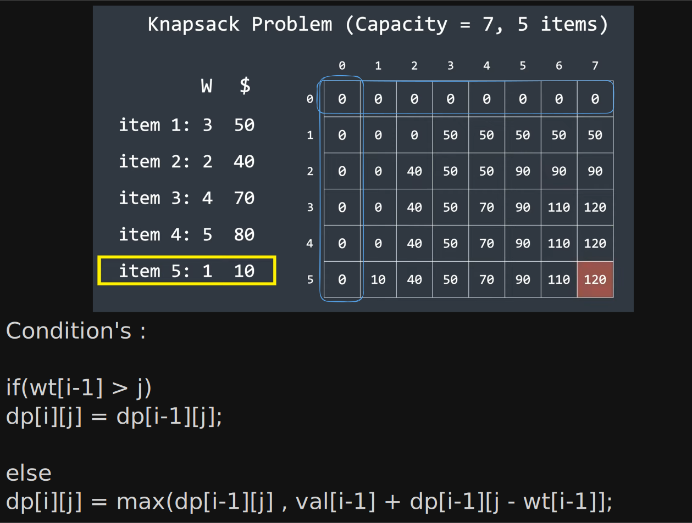

- In this problem we are given an array of items with designated value to each of them and a capacity which should be filled by the items to achieve maximum profit.
- We shall use a 2D dp array to solve this problem.

```cpp
int knapsack(vector<int> &wt, vector<int> &val, int capacity) {
  int n = val.size();
  vector<vector<int>> dp(n + 1, vector<int>(capacity + 1));
  
  for (int i = 0; i <= n; i++) {
    dp[i][0] = 0;
  }
  for (int i = 0; i <= capacity; i++) {
    dp[0][i] = 0;
  }
  
  for (int i = 1; i <= n; i++) {
    for (int j = 1; j <= capacity; j++) {
      if (wt[i - 1] > j) {
        dp[i][j] = dp[i - 1][j];
      } else {
        dp[i][j] = max(dp[i - 1][j], val[i - 1] + dp[i - 1][j - wt[i - 1]]);
      }
    }
  }
  return dp[n][capacity];
}
```

> Time Complexity :
> Space Complexity :


